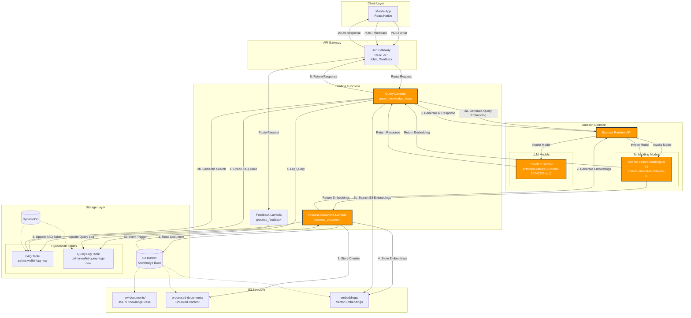

# Palma AI Support Service - Architecture Diagram

## Amazon Bedrock Architecture

This diagram illustrates how Amazon Bedrock is integrated into the Palma AI Support Service for both document processing and query handling.

## Bedrock Usage Details

### 1. Embedding Generation (Cohere Embed Multilingual v3)

**Used in:**
- **Process Document Lambda**: Generates embeddings for document chunks during ingestion
- **Query Lambda**: Generates embeddings for user queries for semantic search

**Model ID:** `cohere.embed-multilingual-v3`

**Configuration:**
- **For Documents**: `input_type: "search_document"` - Optimized for documents to be searched
- **For Queries**: `input_type: "search_query"` - Optimized for search queries
- **Truncation**: `END` - Truncates at the end if text exceeds model limits

**Purpose:**
- Converts text into high-dimensional vectors (embeddings)
- Enables semantic similarity search across knowledge base
- Supports multilingual content (though currently configured for English only)

### 2. AI Response Generation (Claude 3 Sonnet)

**Used in:**
- **Query Lambda**: Generates contextual responses based on retrieved knowledge

**Model ID:** `anthropic.claude-3-sonnet-20240229-v1:0`

**Configuration:**
- **Max Tokens**: 500
- **Temperature**: 0.3 (lower for more deterministic responses)
- **Top P**: 0.9
- **API Version**: `bedrock-2023-05-31`

**Purpose:**
- Generates natural language responses to user queries
- Synthesizes information from retrieved context
- Provides helpful responses when context is insufficient

## Data Flow

### Document Processing Pipeline

1. **Document Upload**: Knowledge base JSON uploaded to S3 `raw-documents/` folder
2. **S3 Event Trigger**: Triggers Process Document Lambda
3. **Chunking**: Document split into question-answer chunks
4. **Embedding Generation**: Each chunk sent to Bedrock Cohere model for embedding
5. **Storage**: 
   - Chunks stored in `processed-documents/`
   - Embeddings stored in `embeddings/`
   - FAQ items stored in DynamoDB with embeddings

### Query Processing Pipeline

1. **User Query**: Mobile app sends query to API Gateway
2. **FAQ Check**: Lambda first checks DynamoDB FAQ table for exact matches
3. **Embedding Generation**: If no exact match, query embedded using Bedrock Cohere model
4. **Semantic Search**: 
   - Search FAQ table using cosine similarity
   - Fallback to S3 embeddings if no FAQ matches
5. **Context Retrieval**: Top 3 most similar chunks retrieved
6. **AI Response**: Context sent to Bedrock Claude model to generate response
7. **Logging**: Query and response logged to DynamoDB for analytics
8. **Response**: Generated response returned to mobile app

## Key Components

### AWS Services
- **Amazon Bedrock**: AI/ML model inference
- **AWS Lambda**: Serverless compute
- **Amazon S3**: Document and embedding storage
- **Amazon DynamoDB**: FAQ storage and query logging
- **API Gateway**: REST API endpoint

### Bedrock Models
- **Cohere Embed Multilingual v3**: Vector embeddings
- **Claude 3 Sonnet**: Natural language generation

### Fallback Mechanisms
- If Bedrock embedding fails, falls back to deterministic hash-based embeddings
- If no semantic matches found, returns default helpful response
- If exact FAQ match found, returns directly without AI generation

## Security & Permissions

- Lambda functions have IAM permissions to invoke Bedrock models
- API Gateway protected with API keys
- S3 bucket access restricted to Lambda functions
- DynamoDB tables use pay-per-request billing

## Monitoring

- CloudWatch Dashboard tracks Lambda invocations and errors
- Query logs stored in DynamoDB with TTL (30 days)
- Feedback mechanism for continuous improvement
